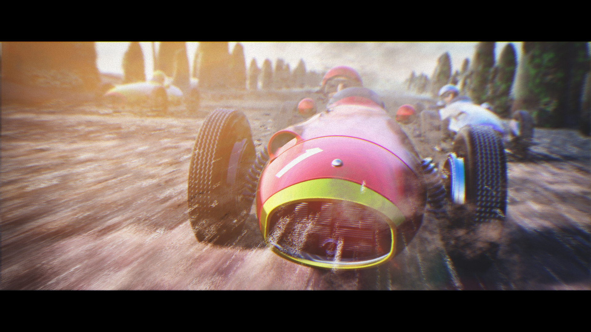
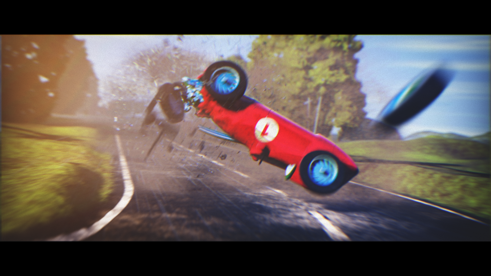
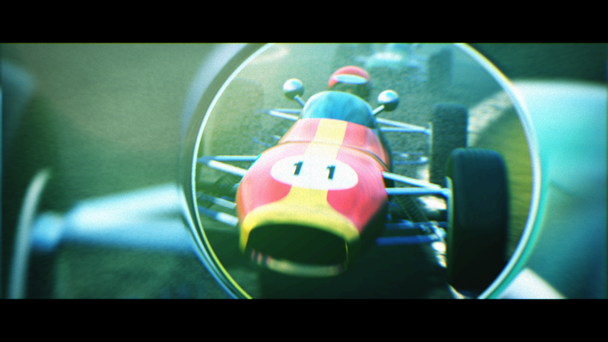
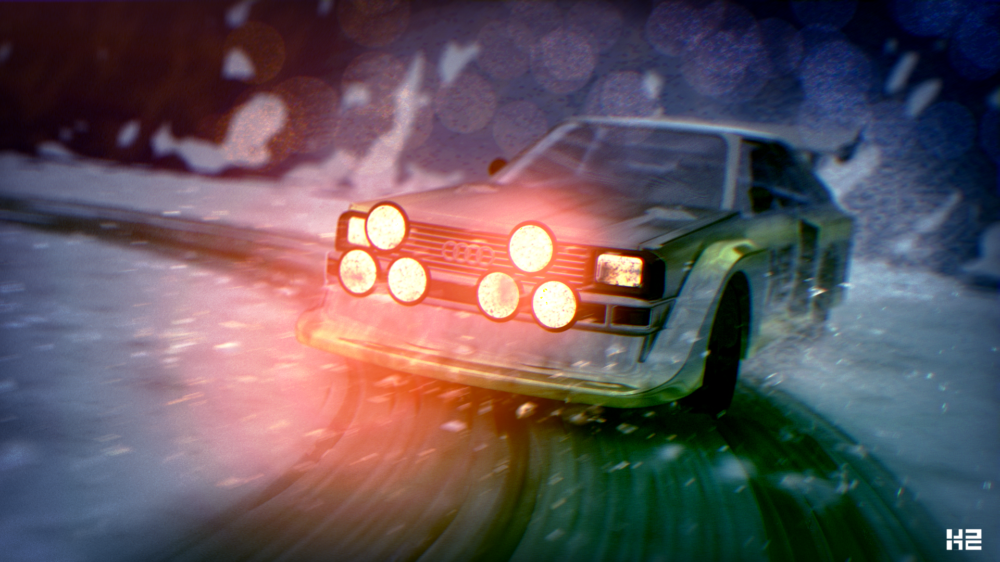
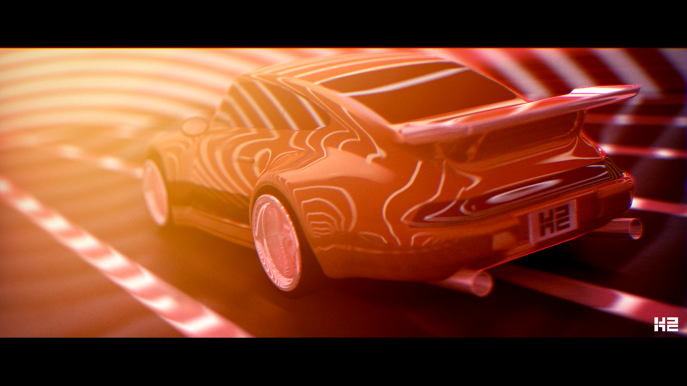

# Michal Klos

CTO @ LEX AI · ex-ByteDance AI Lab · 4K demoscene intros · shaders · Rust/WGPU

[LinkedIn](https://linkedin.com/in/mrmichalklos/) · [X](https://x.com/_spolsh) · [GitHub](https://github.com/sp0lsh) · [Blog](https://codeklos.wordpress.com)

---

## 4K EXE GFX — .klos / k2

### Fast and Fouriers

4K exe gfx · 3rd at Revision 2023 · Meteorics nomination

[Download](k2_fast_and_fouriers.zip) · [pouet.net](https://www.pouet.net/prod.php?which=94605)

---

### 2Fast2Fouriers

4K exe gfx · 1st at Xenium 2023 · Meteorics nomination

[Download](k2_2fast2fouriers.zip) · [pouet.net](https://www.pouet.net/prod.php?which=95188)

---

### Fast and Fouriers: Lauda Drift

4K exe gfx · 3rd at Deadline 2023

[Download](k2_fast_and_fouriers_lauda_drift.zip) · [pouet.net](https://www.pouet.net/prod.php?which=95647)

---

### Quattro

4K exe gfx · 2nd at Revision 2025 · Meteorics nomination

[Download](k2_quattro.zip) · [pouet.net](https://www.pouet.net/prod.php?which=97804)

---

### RWB

4K exe gfx · 2nd at Deadline 2025

[Download](k2_rwb.zip)

---

## Web Demos

- [0x56](0x56/) — WebGL space shooter
- [In The Night](itn/) — JavaScript raycasting engine
- [Snakube](snakube/snakube.html) — Unity3D snake game
- [Star Warrior](StarWarrior/) — Unity3D game
